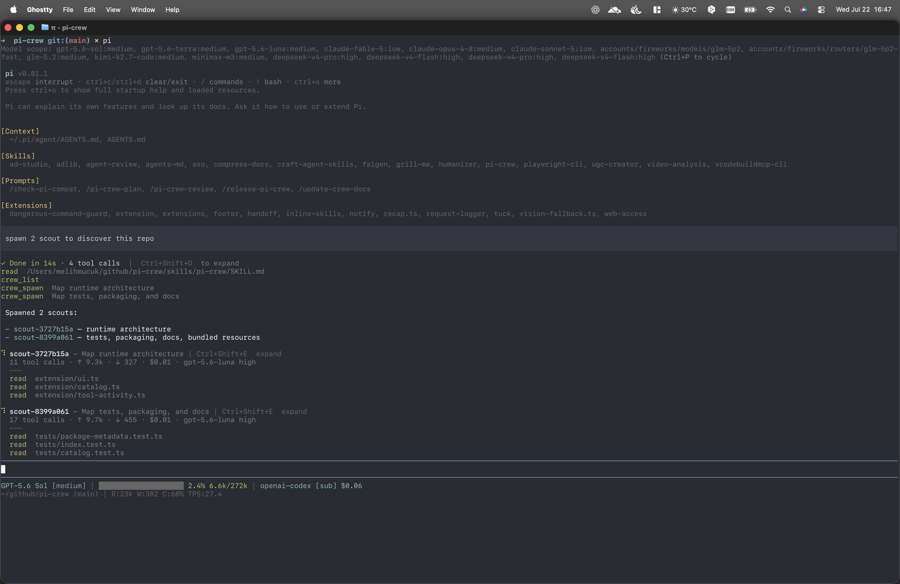

# pi-crew

Non-blocking subagent orchestration for [pi](https://pi.dev). Run isolated subagents in parallel while your current session stays interactive. Updates return automatically to the session that started them.

> [!WARNING]
> **Maintenance status:** pi-crew is no longer actively maintained. The package remains available as-is, but bug fixes, compatibility updates, and support are not guaranteed. Future Pi releases may break it. Feel free to fork the project if you want to continue its development.

## Preview



## Install

From npm:

```bash
pi install npm:@melihmucuk/pi-crew
```

From git:

```bash
pi install git:github.com/melihmucuk/pi-crew
```

This installs the extension, orchestration skill, prompt templates, and bundled subagents. pi-crew requires Pi 0.81.1 or newer.

## How It Works

Once installed, pi-crew exposes these capabilities in your pi session:

### Tools

#### `crew_list`

Lists available subagents and the active subagents owned by the current session, including each subagent's capabilities and whether it supports follow-up messages.

#### `crew_spawn`

Spawns a subagent in an isolated background session. Each spawn needs a short `brief` label and a full, self-contained `task`. Results return automatically to the Pi session that started the work. If that session is inactive, results are queued for up to 24 hours.

```
"spawn scout and find all API endpoints and their authentication methods"
```

#### `crew_abort`

Aborts one, many, or all active subagents owned by the current session.

Supported modes:

- single: `subagent_id`
- multiple: `subagent_ids`
- all active in current session: `all: true`

```
"abort scout-a1b2"
"abort scout-a1b2 and worker-c3d4"
"abort all active subagents"
```

#### `crew_respond`

Sends a follow-up message to an interactive subagent owned by the current session that is waiting for a response. Interactive subagents stay alive after their initial response, allowing multi-turn conversations.

```
"respond to planner-a1b2 with: yes, use the existing auth middleware"
```

#### `crew_done`

Closes a waiting interactive subagent when you no longer need follow-up messages.

```
"close planner-a1b2, the plan looks good"
```

### Prompt Templates

#### `/pi-crew-plan`

Expands a bundled prompt template that orchestrates discovery and planning for implementation tasks.
Use it to spawn scout subagents to investigate the codebase, then delegate to a planner subagent to produce a step-by-step implementation plan.

The required `scout` and `planner` definitions are bundled with pi-crew.

#### `/pi-crew-review`

Expands a bundled prompt template that orchestrates parallel code and quality reviews.
Use it to review provided or default changed-code scope with `code-reviewer` and `quality-reviewer`, using compact task-specific briefs focused on intent, expected behavior, and relevant references, then merge both results into one report.

The required `code-reviewer` and `quality-reviewer` definitions are bundled with pi-crew.

### Skills

#### `pi-crew`

A bundled orchestration skill for writing self-contained tasks, coordinating parallel work, handling results, and managing interactive subagents.

## Bundled Subagents

pi-crew ships with six subagent definitions that cover common workflows:

| Subagent             | Purpose                                                                                                                  | Tools                      | Model                       | Thinking |
| -------------------- | ------------------------------------------------------------------------------------------------------------------------ | -------------------------- | --------------------------- | -------- |
| **scout**            | Investigates codebase and returns structured findings. Read-only.                                                        | read, grep, find, ls, bash | openai-codex/gpt-5.6-luna   | high     |
| **planner**          | Produces deterministic implementation plans. Read-only. Does not write code.                                             | read, grep, find, ls, bash | openai-codex/gpt-5.6-sol    | high     |
| **oracle**           | Evaluates critical decisions, surfaces blind spots, and challenges assumptions. Read-only.                               | read, grep, find, ls, bash | openai-codex/gpt-5.6-sol    | xhigh    |
| **code-reviewer**    | Reviews scoped code for actionable bugs. Does not modify files; may run typecheck and tests.                             | read, grep, find, ls, bash | openai-codex/gpt-5.6-sol    | medium   |
| **quality-reviewer** | Reviews scoped code for maintainability, duplication, and complexity. Read-only.                                         | read, grep, find, ls, bash | openai-codex/gpt-5.6-sol    | medium   |
| **worker**           | Implements scoped code changes safely and verifies them.                                                                 | all                        | openai-codex/gpt-5.6-terra  | high     |

Read-only bundled subagents still keep `bash` for inspection workflows like `git` and `ast-grep`. This is an instruction-level contract, not a sandbox boundary.

## Subagent Discovery

Subagent definitions are discovered from three locations, in priority order:

1. **Project**: `<cwd>/<CONFIG_DIR_NAME>/agents/*.md` (default: `<cwd>/.pi/agents/*.md`)
2. **User global**: `<agentDir>/agents/*.md` (default: `~/.pi/agent/agents/*.md`)
3. **Bundled**: shipped with this package

When multiple sources define a subagent with the same `name`, the higher-priority source wins. This lets you override any bundled subagent by placing a file with the same name in your project or user directory.

## Custom Subagents

Create `.md` files in Pi's project config agents directory (default `<cwd>/.pi/agents/`) or global agent directory (default `~/.pi/agent/agents/`) with YAML frontmatter:

```markdown
---
name: my-subagent
description: What this subagent does
model: anthropic/claude-haiku-4-5
thinking: medium
tools: read, grep, find, ls, bash
skills: skill-1, skill-2
---

Your system prompt goes here. This is the body of the markdown file.

The subagent will follow these instructions when executing tasks.
```

### Frontmatter Fields

| Field         | Required | Description                                                                                                          |
| ------------- | -------- | -------------------------------------------------------------------------------------------------------------------- |
| `name`        | yes      | Subagent identifier. No whitespace, use hyphens.                                                                     |
| `description` | yes      | Shown in `crew_list` output.                                                                                         |
| `model`       | no       | `provider/model-id` format (e.g., `anthropic/claude-haiku-4-5`). Unavailable models use the owner's current model.   |
| `thinking`    | no       | Thinking level: `off`, `minimal`, `low`, `medium`, `high`, `xhigh`, `max`.                                           |
| `tools`       | no       | Comma-separated list or YAML array: `read`, `bash`, `edit`, `write`, `grep`, `find`, `ls`. Omit for all; use an empty value or list for none. |
| `skills`      | no       | Comma-separated list or YAML array of skill names (e.g., `ast-grep`). Omit for all; use an empty value or list for none. |
| `compaction`  | no       | Enable context compaction. Defaults to `true`.                                                                       |
| `interactive` | no       | Keep session alive after response for multi-turn conversations. Defaults to `false`.                                 |

Subagents use the owner's Pi model configuration and credentials. If the selected model is unavailable, pi-crew uses the owner's current model.

## Subagent Overrides via JSON

You can override selected frontmatter fields without editing the `.md` definition files.

Config locations:

- Global: `<agentDir>/pi-crew.json` (default `~/.pi/agent/pi-crew.json`)
- Project: `<cwd>/<CONFIG_DIR_NAME>/pi-crew.json` (default `<cwd>/.pi/pi-crew.json`)

Project config overrides global config. Only these fields are overridable:

- `model`
- `thinking`
- `tools`
- `skills`
- `compaction`
- `interactive`

`name` and `description` cannot be overridden.

Example:

```json
{
  "agents": {
    "scout": {
      "model": "anthropic/claude-haiku-4-5",
      "tools": ["read", "bash"],
      "interactive": false
    },
    "planner": {
      "thinking": "high"
    }
  }
}
```

Override values replace the matching frontmatter fields for the named subagent after discovery. Unknown subagent names and invalid override values are ignored with warnings in `crew_list` output.

## Status Widget

When the current session owns active subagents, the TUI shows their task labels, model and thinking settings, cumulative input/output tokens and cost, tool-call count, and recent tool activity.

On session replacement paths such as `/new`, `/resume`, `/fork`, and `/reload`, subagents keep running and reconnect when their owner session becomes active again. Quitting Pi aborts active subagents.

```
⠹ scout-a1b2 - inspect runtime lifecycle | Ctrl+Shift+E  expand
  14 tool calls · ↑ 38.2k · ↓ 4.8k · $0.09 · gpt-5.6-luna high
  ---
  read  extension/crew.ts
  bash  npm test · 2 steps

⠸ worker-c3d4 - implement compact widget | Ctrl+Shift+E  expand
  23 tool calls · ↑ 82.6k · ↓ 9.1k · $0.24 · gpt-5.6-terra high
  ---
  edit  extension/ui.ts

⏳ planner-e5f6 - plan config changes | Ctrl+Shift+E  expand
  6 tool calls · ↑ 16.4k · ↓ 2.2k · $0.05 · gpt-5.4 high
  ---
  read  README.md
```

`↑` and `↓` show cumulative input and output tokens for the child session; `$` shows its cumulative cost. Interactive subagents waiting for a response show a ⏳ icon. `Ctrl+Shift+E` toggles between the latest three and latest ten tool calls.

## Acknowledgments

Inspired by these projects:

- [pi-subagents](https://github.com/nicobailon/pi-subagents) by [@nicobailon](https://github.com/nicobailon)
- [pi-interactive-subagents](https://github.com/HazAT/pi-interactive-subagents) by [@HazAT](https://github.com/HazAT)

## License

MIT
